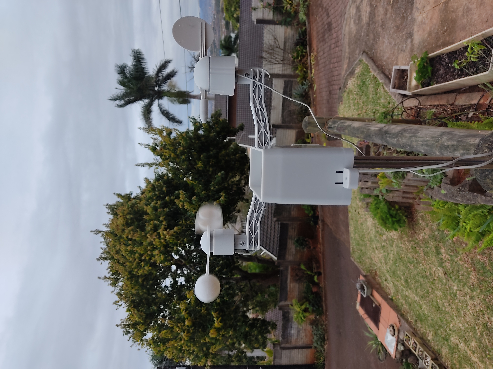

# Weather2MQTT
Simple ESP8266 project to read weather station sensor data from a DIYElectronics 9KITWEATHER / DFRobot SEN0186 weather station kit and publish this data over MQTT to be read by your host of choice e.g. Home Assistant

# Instructions: 
- Clone this repo, rename src/config-sample.h to src/config.h 
- Open project in VSCode with Platformio addon. 
- Edit config.h to add your WiFi SSID and Password as well as any other settings you need such as MQTT server IP 
- Compile and flash to your Wemos D1 Mini / ESP8266

# Hardware Setup:
- The code is setup to read serial from the weather station module on Wemos pin D2, since the data signal level is 5V and the ESP8266 is 3.3v it is suggested to use a level shifter. My suggestion is simple resistor voltage divider, I used Data -> 4k7 -> D2 -> 10k -> Gnd
- (optional) print the case in the 3D Model folder to house the module such that you can use the unit outside your electronics container and get accurate readings of the environment. 
- Connect module 5V and GND to 5V and GND on the Wemos D1.

- If you are using Home Assistant, you can find some example setup in  HomeAssistantConfigYAMLeg.txt

With some luck you should now be getting weather data sent via MQTT to your server :) Enjoy
